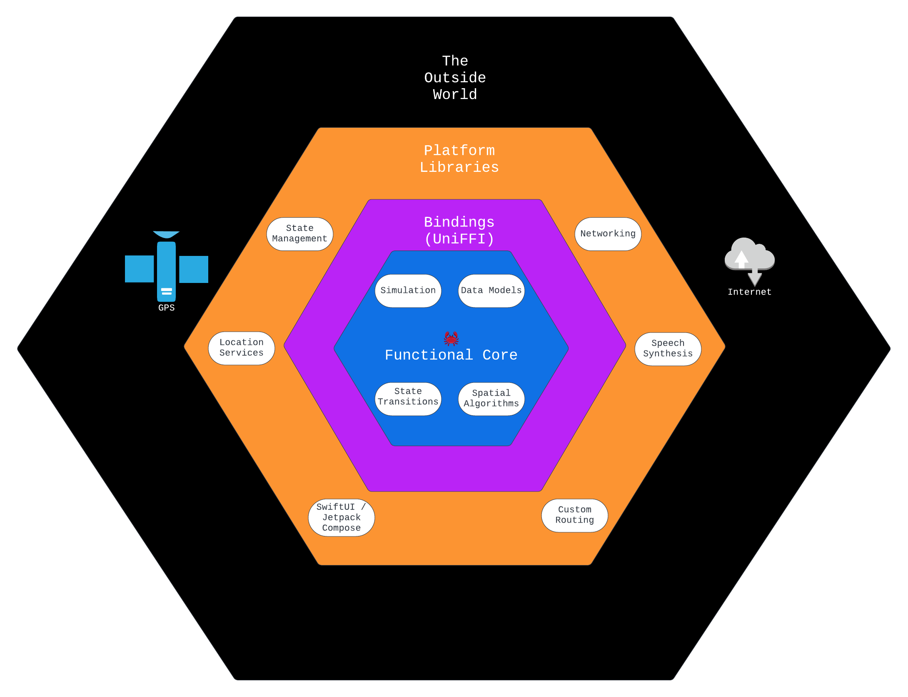

# Architecture Overview

Ferrostar is organized in a moduler (hexagonal) architecture.
At the center sits the core, which is more or less purely functional (no mutable state).
This is great for testability and portability.
In the extreme on the portability side, we Ferrostar should build for WASM and many embedded architectures,
though no frontends currently exist.

One level up is a binding layer.
This is generated using [UniFFI](https://github.com/mozilla/uniffi-rs).
These bindings are usually quite idiomatic, taking advantage of language-specific features like enums, data classes, and async support.

Platform libraries add higher level abstractions, state management, UI, and access to platform APIs like device sensors.
As much as possible, we try to keep the API _similar_ across platforms,
but occasional divergences will pop up here to accommodate platform norms (ex: a single "core delegate" in Swift vs multiple interfaces in Kotlin).

Breaking down the responsibilities by layer:

* Core (Rust)
  - Common data models
  - Request generation and response parsing for APIs (ex: Valhalla and OSRM)
  - Spatial algorithms like line snapping and distance calculations
  - Navigation state machine (which step are we on? sholud we advance to the next one? etc.)
* Bindings (UniFFI; Swift and Kotlin)
  - Auto-generated direct bindings to the core (models, navigation state machine, etc.)
* Platform code (Swift and Kotlin)
  - Higher-level imperative wrappers
  - Platform-native UI (SwiftUI / Jetpack Compose + MapLibre)
  - Interface with device sensors and other platform APIs
  - Networking

As in any hexagonal architecture, you can't skip across multiple layer boundaries, and you can't reach outward.

